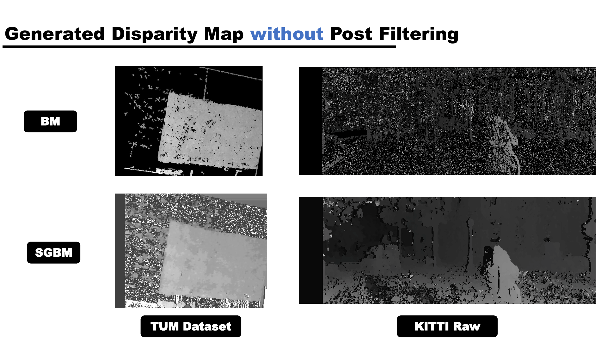
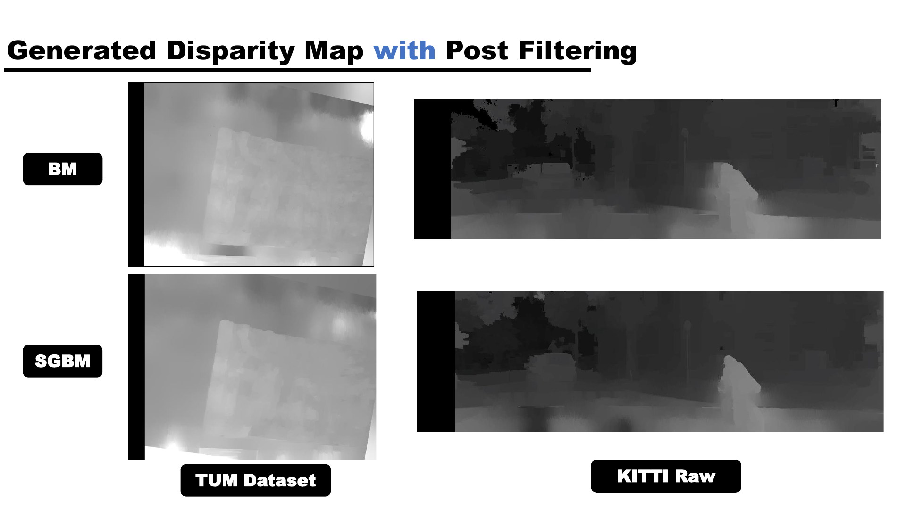
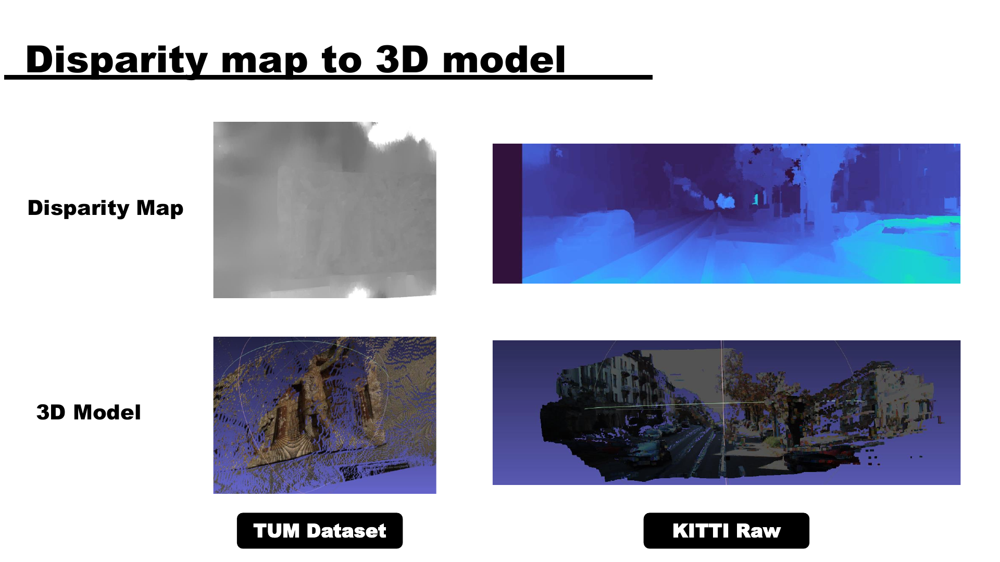
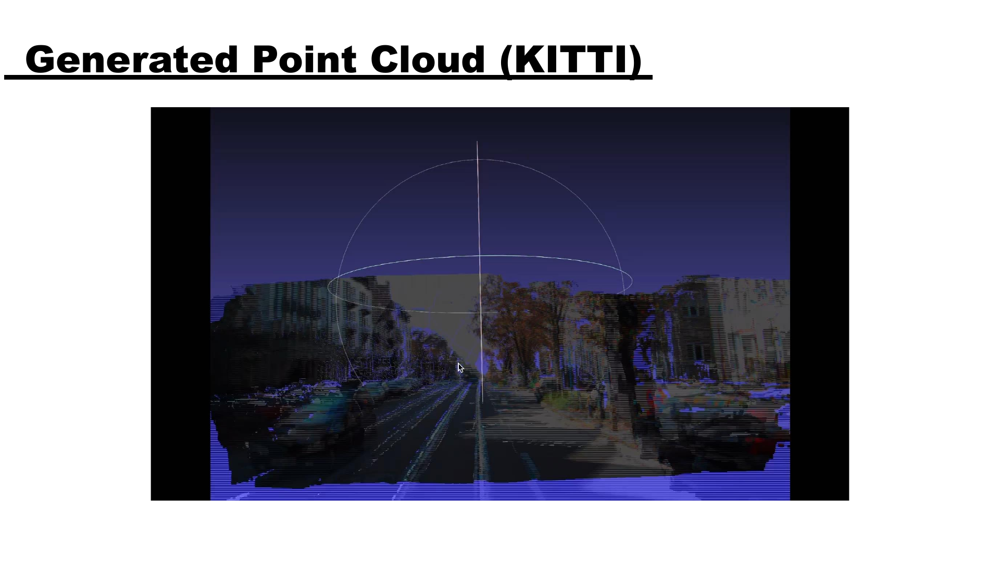

# 3D Scanning and Motion Capturing - Stereo Reconstruction

## 一句话简介

一个从双目图像出发、完成稀疏匹配、视差估计到点云/网格生成的立体视觉三维重建项目。

## 网页文案草案

> 我构建了一条双目立体重建流程：从图像特征匹配与相机位姿估计开始，经由校正和稠密视差计算，最终生成可视化的点云与三维网格。项目在 TUM Intrinsic3D 与 KITTI Stereo 2015 数据集上对比了不同方法，并把重建结果连接到机器人导航、场景理解和对象识别等应用场景。

## 项目目标与背景

- 目标是由多视角/双目输入生成三维模型。
- 演示稿列举的应用包括：手术规划中的器官模型、历史建筑重建、机器人导航环境重建，以及 Notre-Dame 重建案例。
- 数据集：TUM Intrinsic3D Bricks RGBD、KITTI Stereo 2015。
  - TUM 提供彩色/深度图、相机内参、相机位姿与单物体多视图。
  - KITTI 提供视差图、彩色图、畸变系数、外参与多场景图像。

## 实现与方法

1. **稀疏匹配**：特征点检测、描述子匹配、基础矩阵/本质矩阵估计、三角化与相机位姿估计。
2. **方法评估**：对 ORB、SURF、BRISK、Shi-Tomasi、FAST、SIFT 等特征方法进行比较；演示稿说明后续步骤使用真实平移量，因为各方法的平移误差偏高。
3. **图像校正**：使匹配点落在平行极线上，为逐行视差搜索创造条件。
4. **稠密匹配**：对比 Block Matching（BM）与 Semi-Global Block Matching（SGBM），包含后处理前后的视差图结果。
5. **三维生成**：将视差图转换为深度、点云和三维网格。

## 明确提及的工具/概念

`FLANN`（最近邻/描述子匹配）、`Ceres Solver`（非线性优化）、RANSAC、基础矩阵、本质矩阵、立体校正、BM、SGBM、SAD、Birchfield-Tomasi dissimilarity、点云、网格。

## 结果与结论

- 完成端到端 stereo reconstruction pipeline，涵盖校准、关键点计算与 3D model construction。
- 在 TUM 与 KITTI 数据上产出视差、三维模型与点云可视化。
- 演示稿将其定位为后续研究的起点：可引入 ICP、更多数据与更稳健的算法，提升模型精度和鲁棒性。

## 建议展示素材

### 重建管线

### 视差图对比

### 最终三维结果

## 链接与来源

- 演示文稿：[3DReconstruction.pdf](../pdf/3DReconstruction.pdf)
- 演示视频：[3D.mp4](../videos/3D.mp4)

