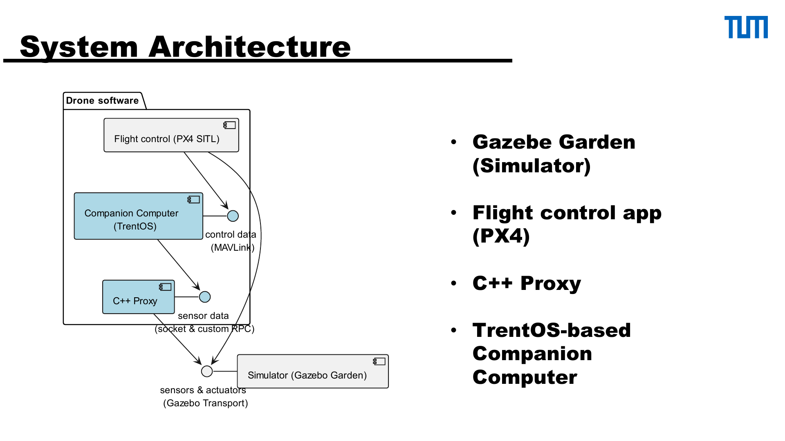
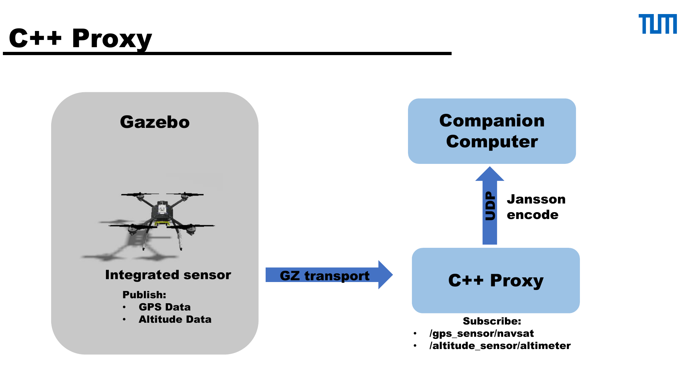
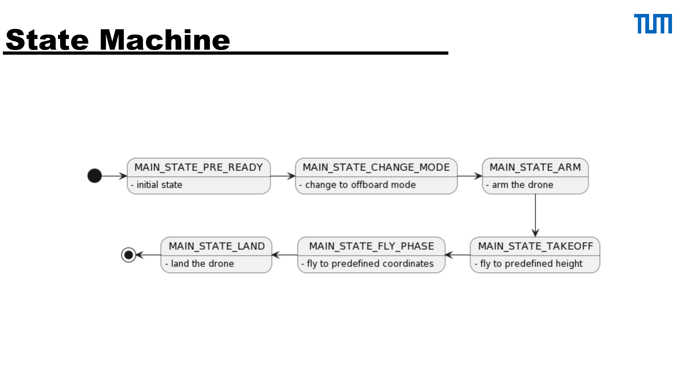
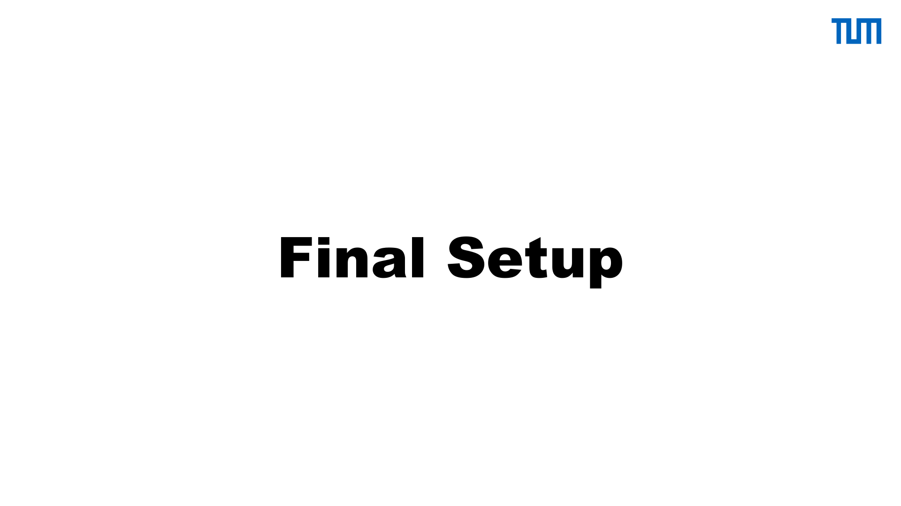
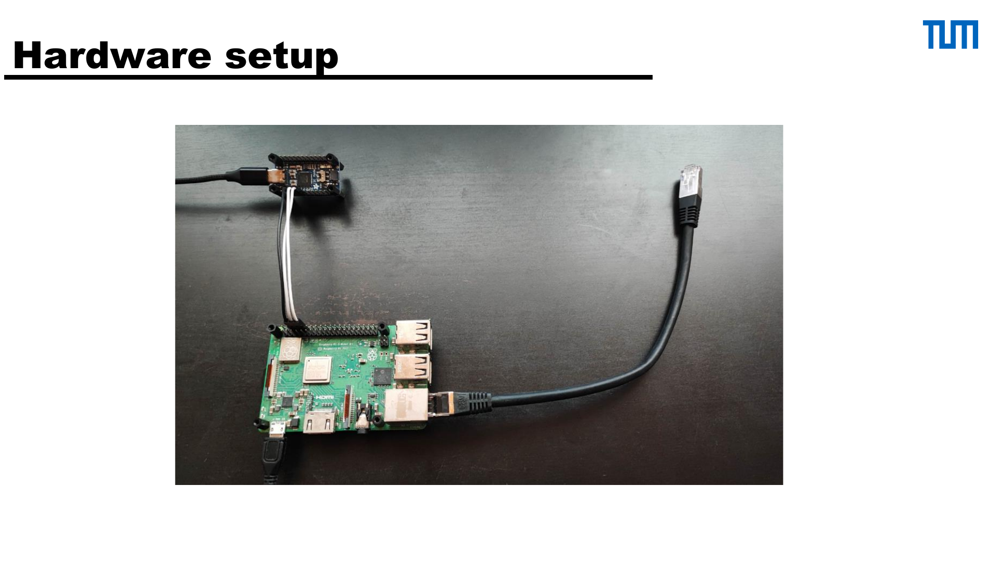
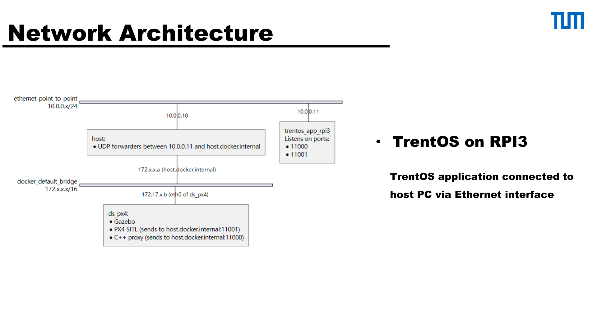

# seL4 & TRENTOS Drone Simulator

## 一句话简介

一个基于 Gazebo、PX4 SITL、C++ Proxy 与 TrentOS companion computer 的无人机仿真控制系统，通过 MAVLink 让无人机按 GPS 和高度传感器数据飞往预设目的地。

## 网页文案草案

> 这个操作系统项目将飞控、机器人仿真和可信执行环境连接在一起：我围绕 PX4 SITL、Gazebo 与 TrentOS 设计通信链路，让运行在 companion computer 上的飞行任务读取 GPS/高度数据，并通过 MAVLink 控制仿真无人机的起飞、导航与降落。

## 项目目标

在 TrentOS companion computer 上实现飞行任务，接收 Gazebo 的 GPS 与高度传感器数据，并向 PX4 发送 MAVLink actuator/control messages，使仿真无人机按照预设目的地飞行。

## 系统架构

- **Gazebo Garden**：三维机器人仿真器，提供模型、世界及发布订阅通信。
- **PX4 SITL**：飞控应用；通过 uORB 异步消息总线在并发模块间通信，并使用 MAVLink 与外界通信。
- **C++ Proxy**：订阅 Gazebo 的 GPS 与高度 topic，以 Jansson 编码并经 UDP 发送给 companion computer。
- **TrentOS companion computer**：执行飞行任务，处理传感器信息并经 MAVLink 向 PX4 发出控制命令。

## 关键实现

- 为 PX4-Autopilot 补充自定义无人机模型、世界模型及最小 MAVLink channel；原因是默认 Gazebo 无人机模型没有所需 GPS 与高度传感器。
- 通过 Gazebo plugin 与 pub/sub 完成传感器集成及场景修改。
- 使用的 MAVLink 命令包括：`MAV_CMD_DO_SET_MODE`、`MAV_CMD_COMPONENT_ARM_DISARM`、`SET_POSITION_TARGET_LOCAL_NED`、`MAV_CMD_NAV_LAND`。
- 将飞行逻辑建模为状态机，并展示了最终软硬件及网络部署方案（TrentOS on Raspberry Pi 3，通过以太网连接 host PC）。

## 遇到的问题

- Jansson 依赖的 `sys_clock_gettime()` 未实现。
- Docker GUI 的 X11 authentication 配置、NixOS firewall。
- QEMU socket 的大流量限制，以及 `OS_Socket_recvfrom()` 的地址行为。
- 更复杂的世界模型加载开销过高。

## 后续改进

- 用自动化 utility scripts 收敛多终端启动流程。
- 在生产环境使用 `iptables` 等网络策略。
- 提升 flight task 对 PX4/Gazebo 中断重启的恢复能力，降低 UDP forwarding 的复杂度。

## 建议展示素材

### 组件架构

### 传感器数据代理链路

### 状态与部署

## 链接与来源

- 演示文稿：[Drone.pdf](../pdf/Drone.pdf)
- 演示视频：[DroneDemo.mp4](../videos/DroneDemo.mp4)

