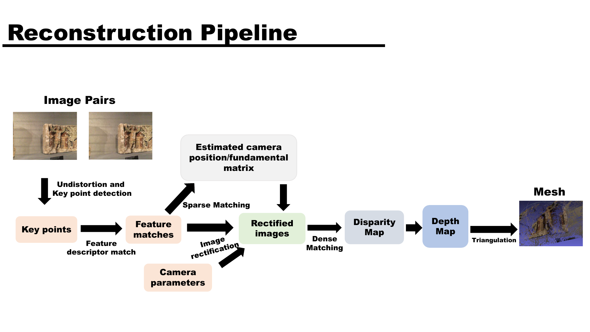
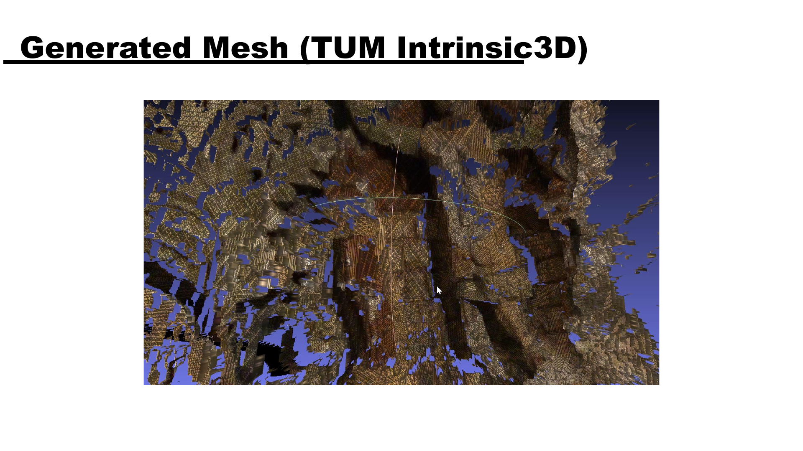

# Stereo 3D Reconstruction

## Summary

An end-to-end stereo reconstruction pipeline that turns stereo imagery into disparity maps, point clouds, and 3D meshes.

## Portfolio copy

> I built a stereo reconstruction workflow spanning feature matching, camera-pose estimation, image rectification, dense disparity estimation, and 3D output generation. The work compares approaches on the TUM Intrinsic3D and KITTI Stereo 2015 datasets and relates the results to scene understanding, object recognition, and robot navigation.

## Approach

- Input data: TUM Intrinsic3D Bricks RGBD and KITTI Stereo 2015.
- Sparse stage: keypoint detection, descriptor matching, fundamental/essential matrix estimation, triangulation, and pose estimation.
- Dense stage: Block Matching and Semi-Global Block Matching, with before/after post-filtering comparisons.
- Output stage: disparity-to-depth conversion, point-cloud generation, and 3D mesh generation.
- Named tools and concepts: FLANN, Ceres Solver, RANSAC, SIFT, ORB, BRISK, BM, SGBM, SAD, and Birchfield-Tomasi dissimilarity.

## Results

The presentation documents the complete reconstruction pipeline and generated disparity maps, a TUM mesh, and a KITTI point cloud. It identifies ICP, more data, and robust algorithms as natural next steps.

## Visuals and source

- [Source PDF](../../pdf/3DReconstruction.pdf)
- [Demo video](../../videos/3D.mp4)

