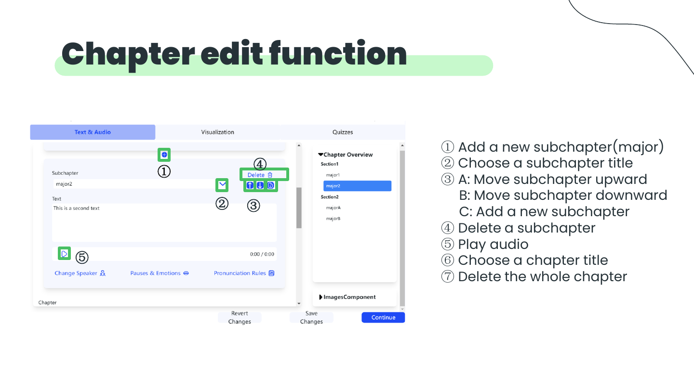
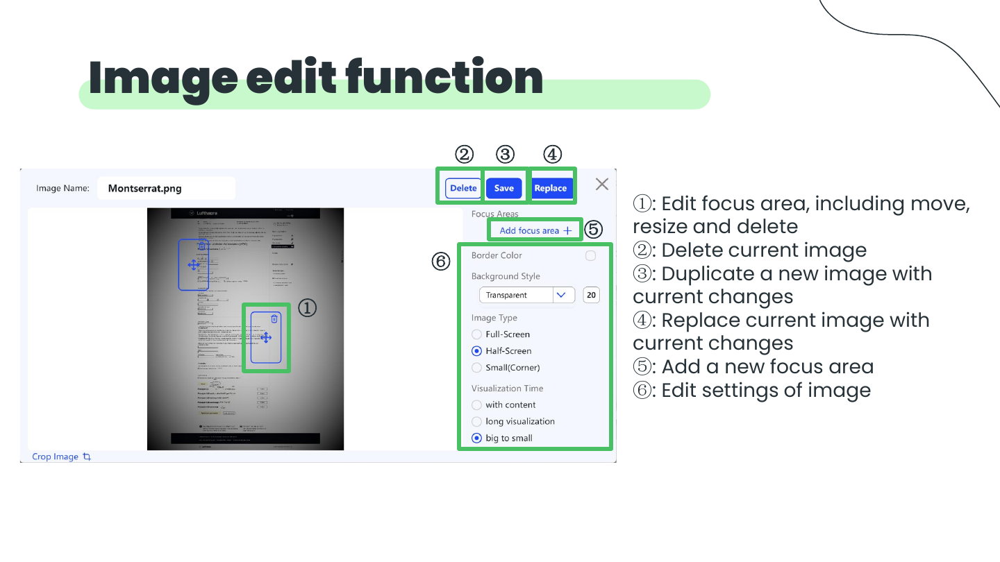

# FAST AI Movie Web

## Summary

An editable web experience for creating customised training videos from text, images, and a chosen speaker.

## Portfolio copy

> FAST AI Movie Web brings generation and editing into one training-video workflow. It supports editable chapter content, audio, slides, icons, quizzes, corporate-design configuration, administration, asset management, and internal visualisation.

## Demonstrated interactions

- Chapter creation, title selection, reordering, deletion, audio playback, and whole-chapter deletion.
- A collapsible chapter overview with current-subchapter highlighting and direct navigation.
- Local image upload, edit/delete, and drag-to-insert from an image library.
- Image focus-area movement, resizing, deletion, duplication, replacement, settings, and additional focus areas.
- Integration of an editable textarea with reusable image components.

- [Source PDF](../../pdf/FASTAIMOVIE.pdf)
- [Demo video](../../videos/FASTAIMOVIE.mp4)

