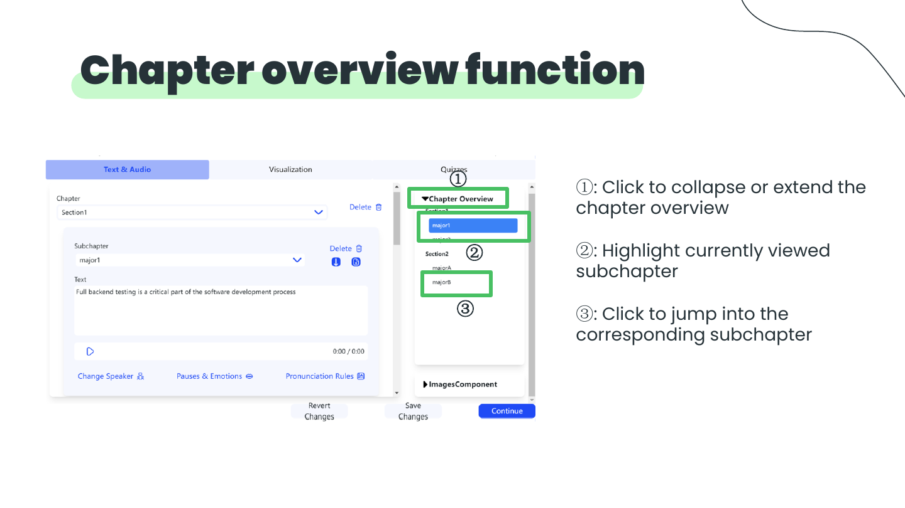
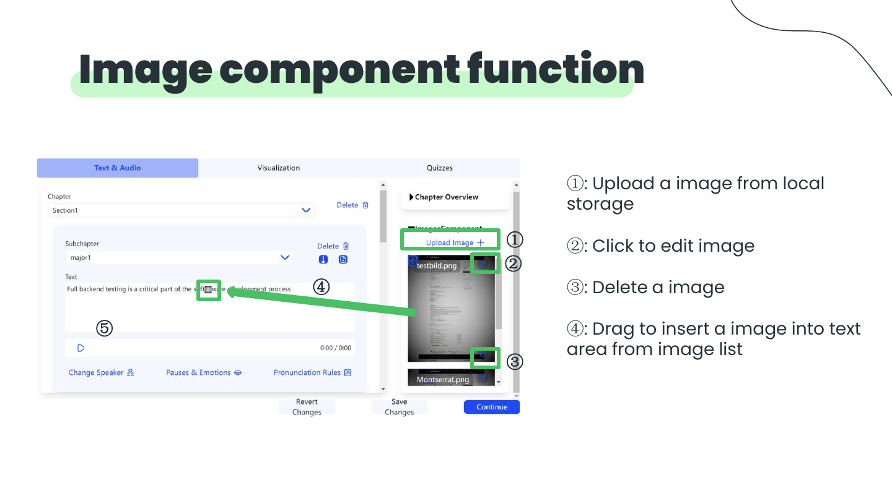
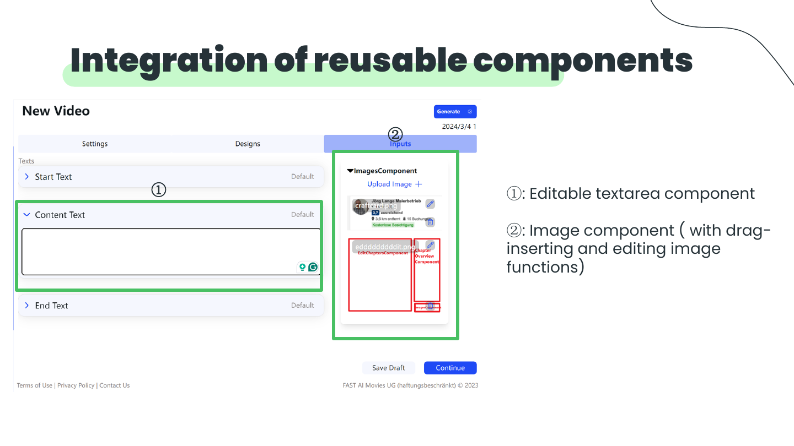

# FAST AI Movie Web

## 一句话简介

一个面向定制化培训视频的 Web 编辑产品：从文本/图片输入与讲者选择出发，支持章节编排、音频、幻灯片、图标、测验、企业设计配置、后台设置与资产管理。

## 网页文案草案

> FAST AI Movie Web 将 AI 培训视频的生成与编辑放在同一个工作流中。产品支持将文本和图片转化为可编辑的培训视频，并提供章节编辑、图片拖拽插入、焦点区域编辑等可复用交互组件，帮助内容团队控制视频结构与视觉呈现。

## 产品范围

- 输入：文本、图片、speaker 选择。
- 输出：定制化培训视频。
- 内容编辑：chapter texts、audio、slides、icons、quizzes。
- 平台能力：corporate design configuration、admin settings、assets management、internal visualization。

## 已展示的交互功能

### 章节编辑

- 新建主子章节、选择子章节标题、上移/下移章节、删除子章节。
- 选择章节标题、删除整章、播放音频。
- 通过折叠/展开的章节概览快速定位；当前查看的子章节会高亮。

### 图片与焦点区编辑

- 从本地上传图片；编辑、删除图片；从图片列表拖拽插入正文。
- 编辑焦点区域的位置与大小，或删除焦点区域。
- 删除、复制、替换当前图片；新增焦点区域；调整图片设置。
- 将可编辑 textarea 与带拖拽/编辑能力的图片组件整合为可复用组件。

## 建议展示素材

### 章节编辑界面

### 素材与图片交互

## 链接与来源

- 演示文稿：[FASTAIMOVIE.pdf](../pdf/FASTAIMOVIE.pdf)
- 演示视频：[FASTAIMOVIE.mp4](../videos/FASTAIMOVIE.mp4)

## 待补充信息

演示稿没有说明前后端技术栈、数据/模型服务、个人职责或上线链接。发布到作品集前，建议补充：项目周期、团队规模、负责的页面/组件、最有价值的设计或工程难点，以及可公开访问的 demo。

