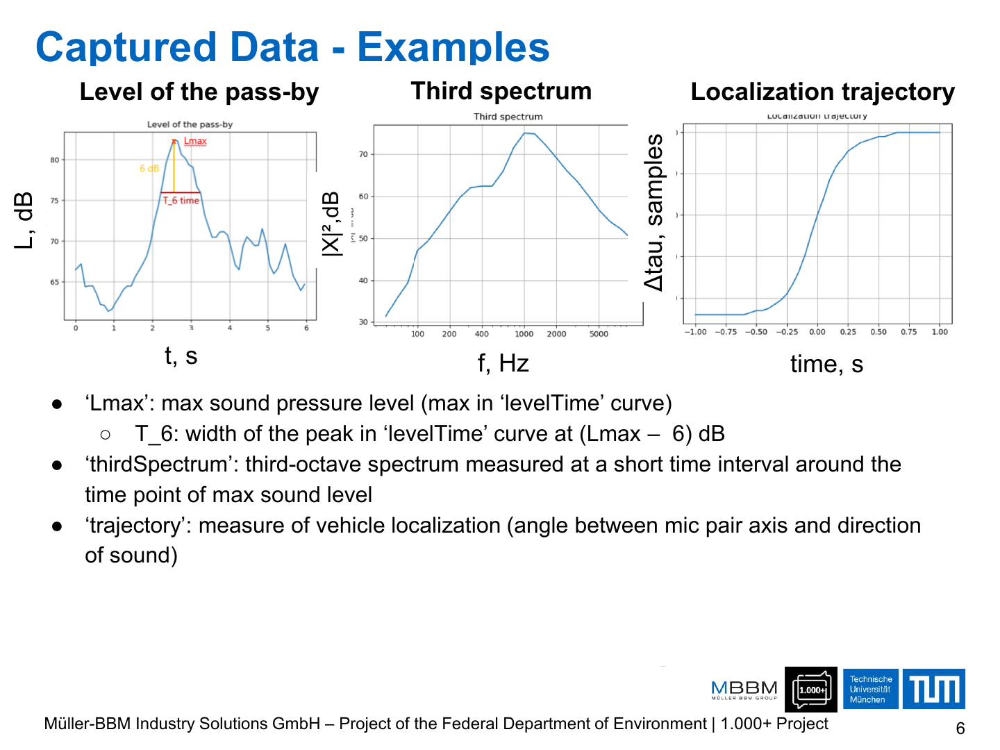
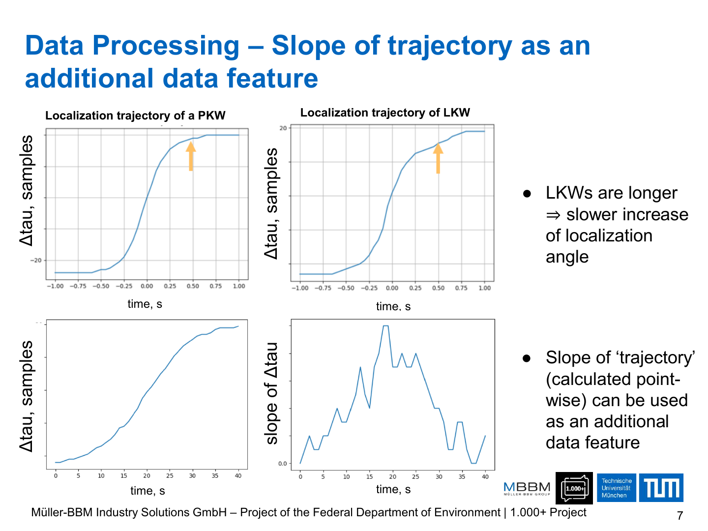
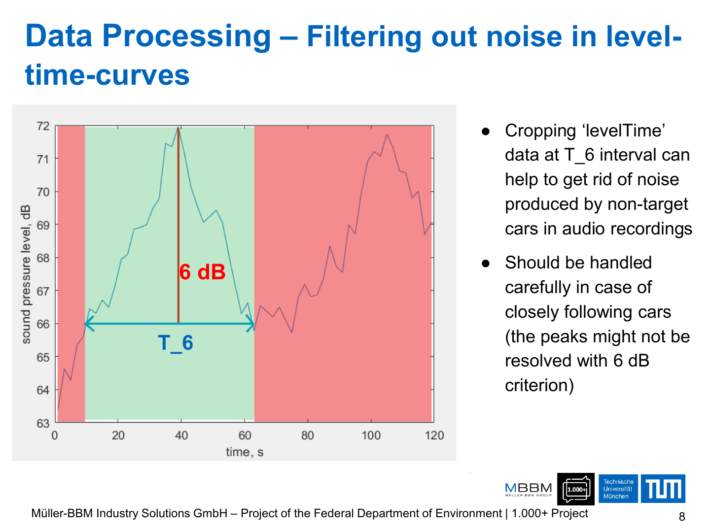
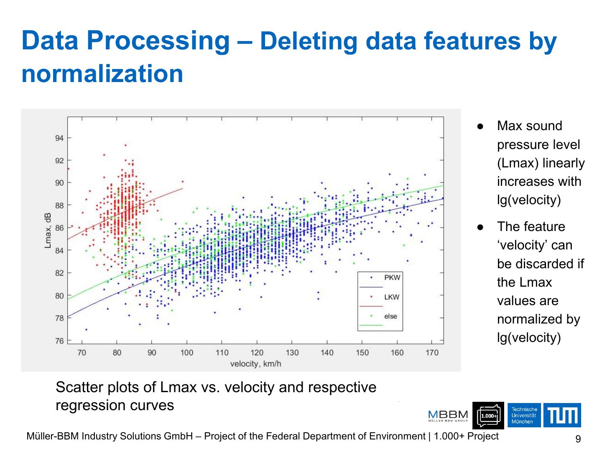
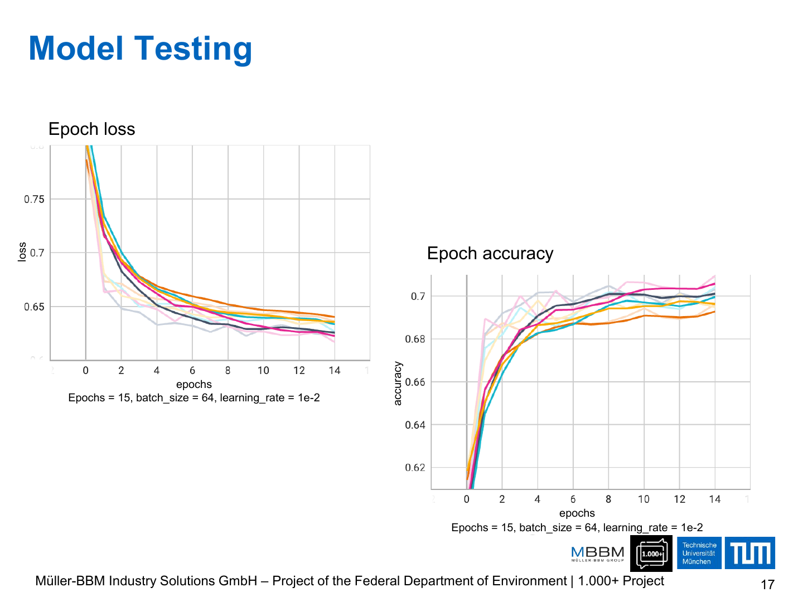
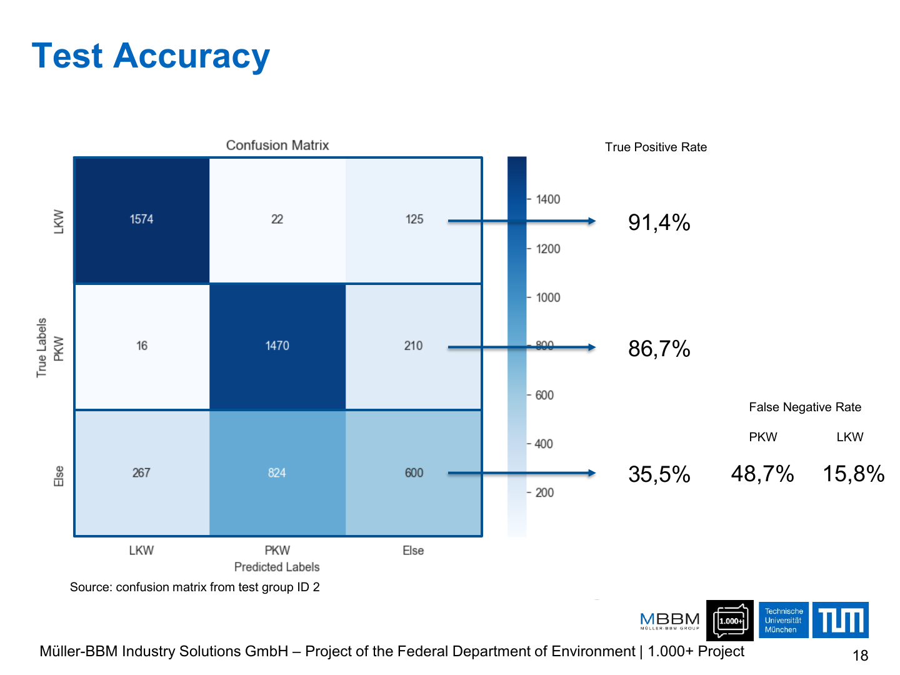
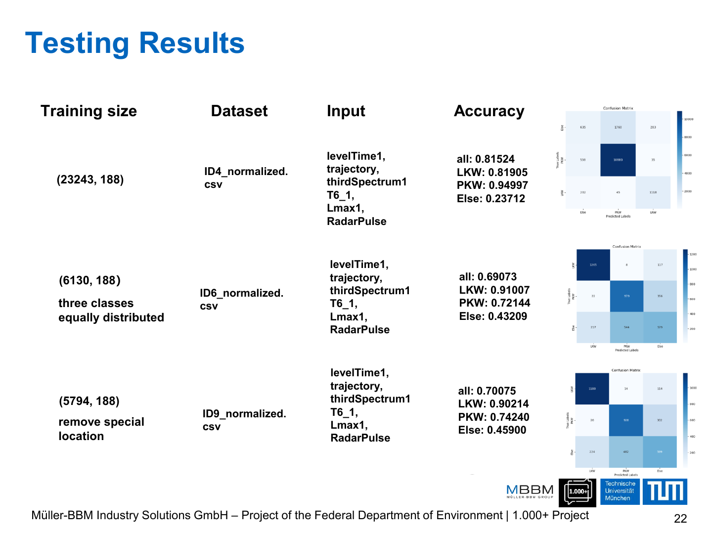
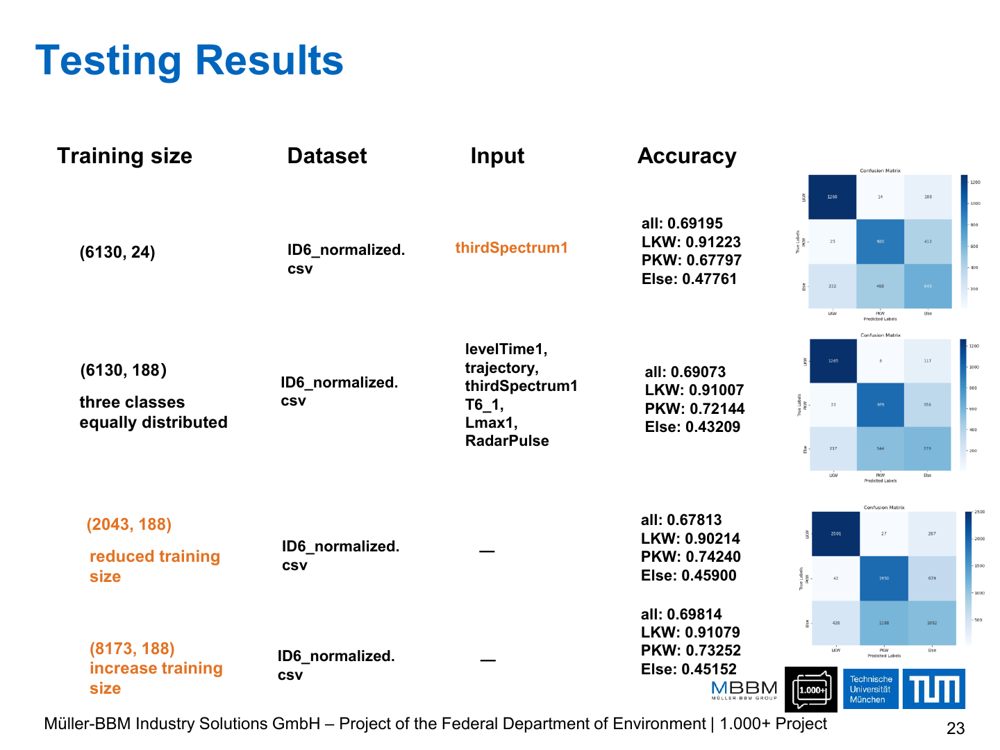

# Vehicle Identification from Roadside Noise Measurements

## 一句话简介

与 Müller-BBM Industry Solutions GmbH 及德国联邦环境部门项目相关的车辆噪声分类探索：基于 30 个地点的测量数据，用数据处理与两类机器学习方法区分乘用车（PKW）、卡车（LKW）及其他类别。

## 网页文案草案

> 我参与了一个以道路噪声测量识别车辆类别的机器学习项目。面对来自 30 个测点、类别不均衡且包含复杂物理信号的数据，我们从声压、频谱、轨迹和雷达等特征入手，完成特征筛选、归一化、类别平衡和多组数据集实验。结果表明，模型能较稳定地区分 PKW 与 LKW，但 “Else” 类别仍是主要挑战。

## 背景与目标

- 目标：通过在 30 个不同位置进行测量，研究德国车辆车队的噪声行为。
- 分类目标：区分 PKW（乘用车）、LKW（卡车）与 Else。
- 项目演示稿显示这是一个为期 5 天的密集项目周，涵盖数据处理、模型训练/测试、结果分析、文档、海报与展示。

## 数据与特征

- `Lmax`：levelTime 曲线中的最大声压级。
- `T_6`：在 `Lmax - 6 dB` 位置处 peak 的宽度。
- `thirdSpectrum`：最大声级附近短时间窗内的三分之一倍频程频谱。
- `trajectory`：车辆定位轨迹（麦克风对轴与声源方向的关系）。
- 还使用了 `radarPulses`、velocity 等信息。

## 数据处理

1. **轨迹斜率特征**：LKW 更长，定位角的增长更慢；因此将 `trajectory` 的逐点斜率作为额外特征。
2. **噪声过滤**：按 `T_6` 截取 level-time 曲线，减少非目标车辆带来的噪声；紧随车辆时需谨慎处理峰值。
3. **特征归一化**：`Lmax` 与 `lg(velocity)` 线性相关，因此以速度归一化后可舍弃 velocity 特征；标量使用 min-max，数组按列最大值缩放。
4. **类别平衡**：从 40,114 × 9 的筛选数据中按 Else:LKW:PKW 取等量样本，形成约 10.5k × 9 的平衡数据集。
5. **条件地点处理**：记录并针对特殊路面/冬季条件地点进行过滤和对照。

## 模型与结果

- 尝试了神经网络训练（演示稿显示 15 epochs、batch size 64、learning rate 1e-2）以及 K Nearest Neighbors（KNN）。
- 测试中，PKW 与 LKW 的识别较强；一个展示结果中的 true positive rate 为 PKW 91.4%、LKW 86.7%、Else 35.5%。
- KNN 结果也显示 LKW、PKW 优于 Else；演示稿列举的一组数据集结果为 overall 0.69073、LKW 0.91007、PKW 0.72144、Else 0.43209。
- `thirdSpectrum` 被明确指出是提升表现的重要特征；数据增多带来轻微提升。

## 结论与下一步

- 两种方法均可较好地区分 LKW 与 PKW，Else 类别仍难分类。
- 类别分布不均会产生“模型表现很好”的误导，必须配合平衡数据与分类别指标评估。
- 后续方向：深化物理分析、增加相关特征、剔除低影响特征、专门研究 LKW 与 Else 的区分，并补充欠采样类别的数据。

## 建议展示素材

### 信号与特征工程

### 模型评估

## 链接与来源

- 演示文稿：[VehicleIdentification.pdf](../pdf/VehicleIdentification.pdf)

